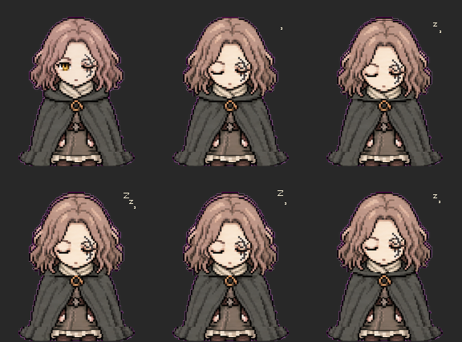

# Pixel Melina（像素梅琳娜）🖥️🐈‍⬛

艾尔登法环「梅琳娜」桌面宠物。像素小人住在你屏幕上，会散步、发呆、蹦迪、打瞌睡，坐在赐福旁给你讲交界地的故事。

**完全离线运行** —— AI 聊天由内置本地模型（Qwen2.5-1.5B）驱动，不需要任何 API 密钥、不联网、不收集任何数据。

## 下载

去 [Releases](../../releases) 页面下载 `PixelMelina-v1.1.zip`，解压后双击 `启动梅琳娜.bat` 即可。

- 系统：Windows 10/11 x64，内存 8GB+
- 无需安装任何东西：Electron 运行时、本地模型、推理引擎全都在包里
- 删除文件夹即完全卸载，无任何残留

## 互动方式

| 操作 | 效果 |
|------|------|
| 左键单击她 | 她轻轻应一声 |
| 左键双击她 | 打开对话框聊天（本地 AI） |
| 右键点她 | 设置菜单 |
| 左键按住拖动 | 拎起来放到屏幕任何位置 |
| 鼠标头顶停留 1 秒 | 摸头反应 |
| 单击赐福 | 她的台词 |
| 菜单「去赐福休整」 | 坐下休息 + 听她讲交界地故事（26 集，续播） |
| 菜单「动作列表」 | 11 个动作点哪个做哪个 |

她会自己散步、发呆、蹦迪，偶尔找赐福坐下打盹（头顶冒 Zzz）。

## 动作预览



## 从源码运行

```bash
npm install                # node-llama-cpp 推理引擎
# 模型（约 1GB）放到 models/ 下：
# https://hf-mirror.com/bartowski/Qwen2.5-1.5B-Instruct-GGUF
#   选 Qwen2.5-1.5B-Instruct-Q4_K_M.gguf
electron .                 # 或双击 启动梅琳娜.bat
```

完整运行包已内置 Electron 运行时（`electron/`）与全部依赖，源码方式运行需要自行安装 Electron 44+。

## 技术结构

- `index.html` —— 渲染层：精灵动画、状态机、聊天 UI
- `main.js` —— Electron 主进程：透明无边框窗口、拖拽、IPC
- `llm_worker.js` —— 独立推理子进程（node-llama-cpp），stdio JSON 通信，崩溃不影响本体
- `models/` —— Qwen2.5-1.5B-Instruct GGUF 量化（Apache-2.0）

## 友情链接

- [LINUX DO](https://linux.do) —— 新的理想型技术社区，欢迎来逛

## 版权说明

本项目为粉丝二创（fan art）。梅琳娜角色及《艾尔登法环》版权归 FromSoftware / 万代南梦宫所有，请勿用于商业用途。
